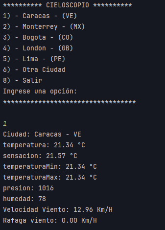

# Cieloscopio

App de consola desarrollada en Java, que por medio de una API (openWeather) consulta los datos meteorológicos actuales de una ciudad, con opciones preestablecidas asi como el ingreso por medio del teclado.

## Imagen descriptiva de la App

## Características:

* Consulta de datos meteorológicos: La aplicación utiliza una API para obtener datos meteorológicos actualizados.
* Opciones preestablecidas: Se incluyen opciones de Ciudades preestablecidas para consultar información, como la temperatura, la humedad, la velocidad del viento, etc.
* Entrada por teclado: Se puede ingresar por teclado una Ciudad distinta a las opciones preestablecidas para consultar datos.
* Interfaz de línea de comandos: La aplicación se ejecuta en la consola, ofreciendo una experiencia de usuario simple y directa.

### Challenge 01 correspondiente al BootCamp Back-End en Java impartido por Alura Latam.  

